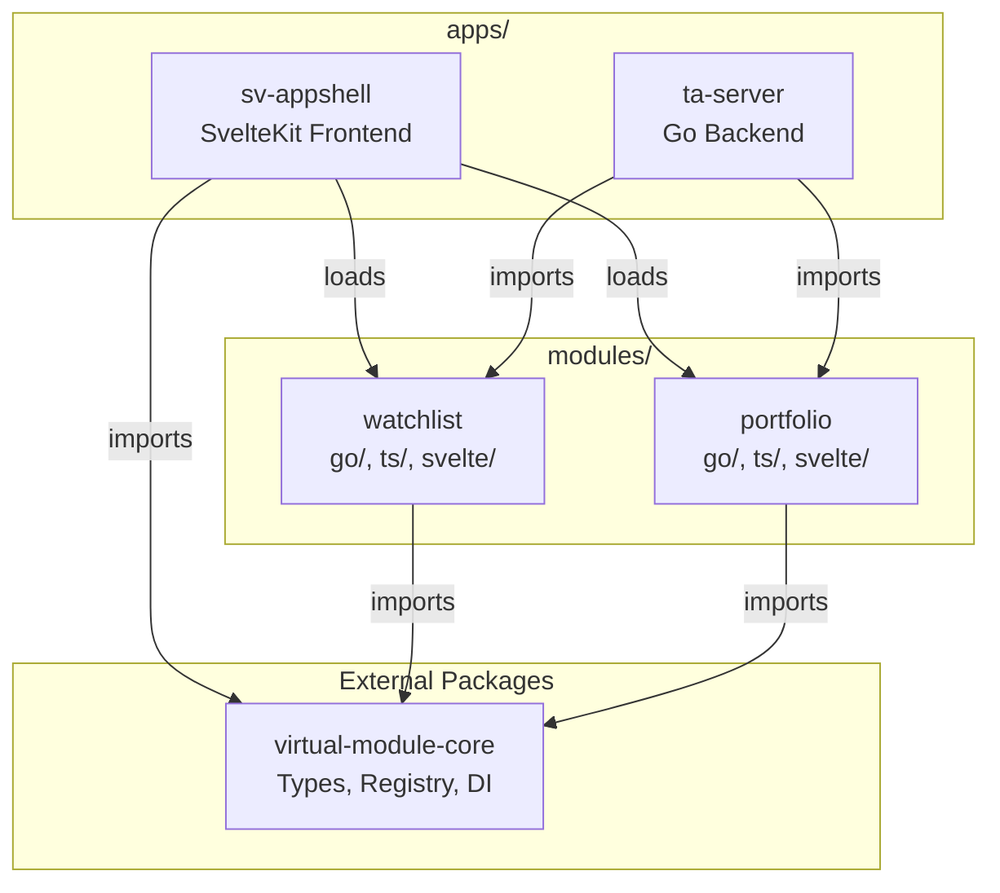
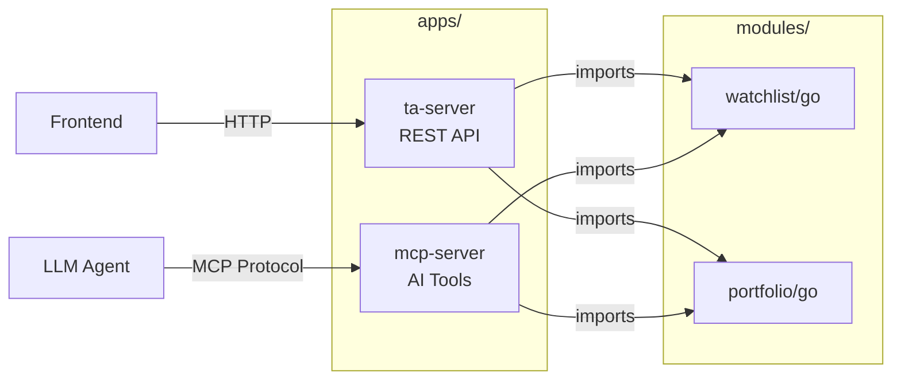

# AppShell Architecture

This document describes the **Virtual Module Architecture** used in the ta-workspace monorepo. It covers both frontend (SvelteKit) and backend (Go/Goa) appshells, explaining how modules are dynamically injected at runtime.

## Overview

The AppShell pattern provides a **host application** that loads and orchestrates feature modules at runtime. This enables:

- **Modularity**: Features are developed independently in `modules/`
- **Composition**: Apps in `apps/` compose modules as needed
- **Shared Core**: Common types and utilities provided by `virtual-module-core` package



---

## Frontend AppShell (sv-appshell)

The SvelteKit frontend uses a **Registry** singleton and **ModuleLoader** to dynamically discover and load modules.

### Module Discovery

[ModuleLoader.ts](file:///c:/Users/reidl/GitLocal/ta-workspace/apps/sv-appshell/src/lib/loader/ModuleLoader.ts) uses Vite's `import.meta.glob` to discover modules:

```typescript
// Glob pattern discovers all module entry points
private static moduleGlob = import.meta.glob('../../../../../modules/*/*/src/index.ts');

static async loadModules(context: IContext, config: IAppConfig[]): Promise<void> {
    for (const moduleConfig of config) {
        if (!moduleConfig.enabled) continue;
        const matchedKey = Object.keys(this.moduleGlob).find(key =>
            key.includes(`/${moduleConfig.src}/`) && key.includes('/src/index.ts')
        );
        if (matchedKey) {
            const module = await this.moduleGlob[matchedKey]();
            const bundle = await module.init(context);
            registry.register(bundle);
        }
    }
}
```

### Registry Singleton

The `Registry` class from `virtual-module-core` stores all registered modules:

```typescript
export class Registry {
  private static instance: Registry;
  private modules = new Map<string, IModuleBundle>();
  private widgetMap = new Map<string, IWidget>();
  private handlers: IHandler[] = [];
  private servicesMap = new Map<string, any>();

  register(bundle: IModuleBundle): void {
    this.modules.set(bundle.id, bundle);
    // Auto-register widgets, handlers, services
    if (bundle.widgets) {
      for (const widget of bundle.widgets) {
        this.widgetMap.set(widget.id, widget);
      }
    }
    if (bundle.handlers) {
      this.handlers.push(...bundle.handlers);
    }
  }
}
```

---

## Virtual Module Interfaces

All modules implement `IModuleBundle` from `virtual-module-core/types`:

```typescript
export interface IModuleBundle {
  id: string;
  widgets?: IWidget[]; // Dashboard tiles, UI components
  handlers?: IHandler[]; // Menu actions, commands
  services?: Record<string, any>;
  routes?: IParamsRoute[]; // Internal navigation routes
}

export interface IWidget {
  id: string;
  title: string;
  component: any; // Svelte component
  location?: string; // 'dashboard', 'sidebar', 'header'
  size?: "small" | "medium" | "large";
}

export interface IHandler {
  id: string;
  title: string;
  execute: (context: IContext) => void | Promise<void>;
}

export type ModuleInit = (context: IContext) => Promise<IModuleBundle>;
```

### Example: Registering a Widget

```typescript
// modules/watchlist/svelte/src/index.ts
export const init: ModuleInit = async (context) => {
  return {
    id: "watchlist",
    widgets: [
      {
        id: "my-tickers",
        title: "My Tickers",
        component: MyTickersWidget,
        location: "dashboard",
        size: "small",
      },
    ],
    routes: [{ path: "/watchlist", component: WatchlistPage }],
  };
};
```

### Widget Navigation

Widgets can trigger navigation to module routes using SvelteKit's `goto`:

```svelte
<script>
import { goto } from '$app/navigation';
</script>

<button onclick={() => goto('/portfolio')}>
    View Portfolio
</button>
```

Routes defined in `IModuleBundle.routes` are matched by the Registry's `getRoute()` method and rendered via SvelteKit's catch-all route (`[...rest]/+page.svelte`).

---

## Backend AppShell (ta-server)

The Go backend uses the **Goa framework** with service injection from virtual modules.

### Why Goa?

[Goa](https://goa.design) is a **design-first** API framework for Go that provides:

| Feature                | Benefit                                                   |
| ---------------------- | --------------------------------------------------------- |
| **DSL-based Design**   | API contracts defined in Go code, not YAML/JSON           |
| **Code Generation**    | Server stubs, clients, OpenAPI specs auto-generated       |
| **Type Safety**        | Compile-time validation of request/response types         |
| **Transport Agnostic** | Same design generates HTTP, gRPC, or WebSocket handlers   |
| **Middleware Support** | Integrates with Chi router for flexible middleware chains |

This aligns with the virtual module pattern—each module defines its API contract, and Goa generates the transport layer.

### Extending to MCP Servers (goa-ai)

[Goa-AI](https://goa.design/ai) extends Goa for building **Model Context Protocol (MCP)** servers, enabling AI agents to discover and invoke your services:

```go
// Future: apps/mcp-server/design/design.go
import (
    . "goa.design/goa/v3/dsl"
    "goa.design/ai/dsl"
)

var _ = ai.Agent("ta-assistant", func() {
    ai.Description("Technical Analysis Assistant Agent")

    // Expose existing services as AI tools
    ai.Tool("get-watchlist", func() {
        ai.Description("Retrieve user's stock watchlist")
        ai.ToolService(WatchlistService)  // Reference existing Goa service
    })

    ai.Tool("get-portfolio-insights", func() {
        ai.Description("Get AI-generated portfolio insights")
        ai.ToolService(PortfolioService)
    })
})
```

**MCP Server Benefits:**

- **Tool Discovery**: LLMs automatically discover available tools
- **Typed Contracts**: Same Goa type safety for AI interactions
- **Streaming**: Built-in support for streaming responses to agents
- **Temporal Durability**: Goa-AI integrates with Temporal for robust workflows

**Architecture with MCP:**



### Goa Design Pattern

Each module defines its API in a `design/*.go` file:

```go
// modules/portfolio/go/design/portfolio.go
var _ = Service("portfolio", func() {
    Description("Provide AI insights")

    Method("list", func() {
        Payload(func() {
            Attribute("user_id", String, "User ID")
            Required("user_id")
        })
        Result(ArrayOf(Insight))
        HTTP(func() {
            GET("/portfolio")
            Header("user_id:X-User-ID")
        })
    })
})
```

### Service Injection

[api-server.go](file:///c:/Users/reidl/GitLocal/ta-workspace/apps/ta-server/cmd/api-server.go) wires module services:

```go
// Import module implementations
import (
    portfolio "github.com/reidlai/ta-workspace/modules/portfolio/go/pkg"
    watchlist "github.com/reidlai/ta-workspace/modules/watchlist/go/pkg"
)

// Initialize services
watchlistSvc = watchlist.NewWatchlist(logger)
portfolioSvc = portfolio.NewPortfolio(logger)

// Create endpoints
watchlistEndpoints = watchlistGen.NewEndpoints(watchlistSvc)
portfolioEndpoints = portfolioGen.NewEndpoints(portfolioSvc)

// Mount on HTTP server
server.HandleHTTPServer(ctx, u, watchlistEndpoints, portfolioEndpoints, ...)
```

---

## RxJS + Svelte Store Integration

RxJS `BehaviorSubject` integrates seamlessly with Svelte's store contract:

```typescript
// modules/watchlist/ts/src/services/WatchlistService.ts
export class WatchlistService {
  private _tickers$ = new BehaviorSubject<TickerItem[]>([]);
  public readonly tickers$ = this._tickers$.asObservable();

  // Svelte-compatible subscribe method
  public subscribe(run: (value: TickerItem[]) => void): () => void {
    const subscription = this._tickers$.subscribe(run);
    return () => subscription.unsubscribe();
  }
}
```

Usage in Svelte:

```svelte
<script>
import { watchlistService } from '@watchlist/services';
</script>

{#each $watchlistService as ticker}
    <p>{ticker.symbol}</p>
{/each}
```

### ModuleStateStore

For cross-module state, [moduleState.ts](file:///c:/Users/reidl/GitLocal/ta-workspace/apps/sv-appshell/src/lib/stores/moduleState.ts) provides channel-based communication:

```typescript
class ModuleStateStore {
  private channels: Map<string, Writable<any>> = new Map();

  getChannel<T>(channelId: string, initialValue?: T): Writable<T> {
    if (!this.channels.has(channelId)) {
      this.channels.set(channelId, writable<T>(initialValue));
    }
    return this.channels.get(channelId);
  }

  updateState<T>(channelId: string, value: T, source: string) {
    // Last-writer-wins with requestAnimationFrame batching
  }
}
```

---

## Virtual Modules in Isolated Packages

When developing Svelte components in isolated packages (e.g., `modules/portfolio/svelte`), SvelteKit virtual modules like `$app/navigation` won't resolve. Create type stubs:

```typescript
// modules/portfolio/svelte/src/app.d.ts
declare module "$app/navigation" {
  export function goto(url: string | URL, opts?: any): Promise<void>;
}
```

This satisfies TypeScript at compile time; the consuming app provides the runtime implementation.

---

## Future Extensibility

The virtual module architecture extends to other frontend frameworks using the same ReactiveX patterns.

### NextJS Integration

NextJS can serve as an alternative frontend appshell, with or without Redux for state management.

#### Option 1: NextJS with Direct RxJS (No Redux)

**Module Structure:**

```
modules/watchlist/
├── go/          # Backend service
├── ts/          # Shared RxJS service
|    └──src/
|      └── services/
|          └── WatchlistService.ts
├── svelte/      # SvelteKit UI
└── nextjs/      # NextJS UI (future)
    └── src/
        ├── components/
        │   └── MyTickersWidget.tsx
        ├── hooks/
        │   └── useWatchlist.ts
        └── store/
            └── watchlistSlice.ts

```

**1. Shared RxJS Service** (already exists in `modules/watchlist/ts/`):

```typescript
import { BehaviorSubject } from "rxjs";

export interface TickerItem {
  symbol: string;
  on_hand: boolean;
  created_at?: string;
}

export class WatchlistService {
  private static instance: WatchlistService;
  private userId = "demo-user";

  // RxJS BehaviorSubject for state management
  private _tickers$ = new BehaviorSubject<TickerItem[]>([]);

  // Expose as observable for read-only access
  public readonly tickers$ = this._tickers$.asObservable();

  private constructor() {
    this.fetchTickers();
  }

  public static getInstance(): WatchlistService {
    if (!WatchlistService.instance) {
      WatchlistService.instance = new WatchlistService();
    }
    return WatchlistService.instance;
  }

  /**
   * Svelte-compatible subscribe method.
   * Svelte auto-subscribes to any object with this signature.
   */
  public subscribe(run: (value: TickerItem[]) => void): () => void {
    const subscription = this._tickers$.subscribe(run);
    return () => subscription.unsubscribe();
  }

  public async fetchTickers(): Promise<void> {
    try {
      const res = await fetch("/api/watchlist", {
        headers: { "X-User-ID": this.userId },
      });
      if (res.ok) {
        const data = await res.json();
        this._tickers$.next(data);
      }
    } catch (e) {
      console.error(e);
    }
  }

  public async addTicker(symbol: string, onHand: boolean): Promise<void> {
    try {
      const res = await fetch("/api/watchlist", {
        method: "POST",
        headers: {
          "Content-Type": "application/json",
          "X-User-ID": this.userId,
        },
        body: JSON.stringify({ symbol, on_hand: onHand, user_id: this.userId }),
      });
      if (res.ok) {
        await this.fetchTickers();
      }
    } catch (e) {
      console.error(e);
    }
  }

  public async removeTicker(symbol: string): Promise<void> {
    try {
      const res = await fetch(`/api/watchlist/${symbol}`, {
        method: "DELETE",
        headers: { "X-User-ID": this.userId },
      });
      if (res.ok) {
        await this.fetchTickers();
      }
    } catch (e) {
      console.error(e);
    }
  }
}

export const watchlistService = WatchlistService.getInstance();
```

**NextJS Component** (direct RxJS subscription):

NextJS (React) can directly consume RxJS Observables because:

1. **Shared Runtime**: Both run in JavaScript/TypeScript environments (browser or Node.js)
2. **Observable Pattern**: RxJS `Observable.subscribe()` returns an unsubscribe function, which fits perfectly with React's `useEffect` cleanup pattern
3. **No Framework Lock-in**: The `WatchlistService` from `modules/watchlist/ts/` is framework-agnostic—it's pure TypeScript with RxJS
4. **Type Safety**: TypeScript types (`TickerItem[]`) are shared across all frameworks

This means `modules/watchlist/nextjs/` can **import and use** the exact same service instance as `modules/watchlist/svelte/` without any adaptation layer.

```tsx
// modules/watchlist/nextjs/components/MyTickersWidget.tsx
import { useEffect, useState } from "react";
import { watchlistService } from "@watchlist/services";

export const MyTickersWidget = () => {
  const [tickers, setTickers] = useState<TickerItem[]>([]);

  useEffect(() => {
    const subscription = watchlistService.tickers$.subscribe(setTickers);
    watchlistService.fetchTickers();
    return () => subscription.unsubscribe();
  }, []);

  return (
    <div className="card">
      <h2>My Tickers</h2>
      {tickers.map((t) => (
        <div key={t.symbol}>{t.symbol}</div>
      ))}
    </div>
  );
};
```

#### Option 2: NextJS with Redux (Optional)

For larger applications, Redux can centralize state management:

**2. Redux Slice** (bridges RxJS to Redux):

**Why Redux Integration Works:**

1. **Shared Runtime**: Both run in JavaScript/TypeScript environments (browser or Node.js)
2. **Observable Pattern**: RxJS `Observable.subscribe()` returns an unsubscribe function, which fits perfectly with React's `useEffect` cleanup pattern
3. **No Framework Lock-in**: The `WatchlistService` from `modules/watchlist/ts/` is framework-agnostic—it's pure TypeScript with RxJS
4. **Type Safety**: TypeScript types (`TickerItem[]`) are shared across all frameworks

This means `modules/watchlist/nextjs/` can **import and use** the exact same service instance as `modules/watchlist/svelte/` without any adaptation layer.

```typescript
// modules/watchlist/nextjs/store/watchlistSlice.ts
import { createSlice, PayloadAction } from "@reduxjs/toolkit";
import { watchlistService } from "@watchlist/services";

const watchlistSlice = createSlice({
  name: "watchlist",
  initialState: { tickers: [] as TickerItem[] },
  reducers: {
    setTickers: (state, action: PayloadAction<TickerItem[]>) => {
      state.tickers = action.payload;
    },
  },
});

export const { setTickers } = watchlistSlice.actions;
export default watchlistSlice.reducer;

// Bridge: Subscribe RxJS to Redux
export const initWatchlistSync = (store: any) => {
  watchlistService.tickers$.subscribe((tickers) => {
    store.dispatch(setTickers(tickers));
  });
};
```

**3. NextJS Hook** (consumes Redux state):

```typescript
// modules/watchlist/nextjs/hooks/useWatchlist.ts
import { useSelector } from "react-redux";
import { watchlistService } from "@watchlist/services";

export const useWatchlist = () => {
  const tickers = useSelector((state: RootState) => state.watchlist.tickers);

  return {
    tickers,
    fetchTickers: () => watchlistService.fetchTickers(),
    addTicker: (symbol: string) => watchlistService.addTicker(symbol, false),
  };
};
```

**4. NextJS Widget Component**:

```tsx
// modules/watchlist/nextjs/components/MyTickersWidget.tsx
import { useWatchlist } from "../hooks/useWatchlist";

export const MyTickersWidget = () => {
  const { tickers, fetchTickers } = useWatchlist();

  useEffect(() => {
    fetchTickers();
  }, []);

  return (
    <div className="card">
      <h2>My Tickers</h2>
      {tickers.map((t) => (
        <div key={t.symbol}>{t.symbol}</div>
      ))}
    </div>
  );
};
```

**5. NextJS AppShell** (`apps/nextjs-appshell`):

```typescript
// apps/nextjs-appshell/app/layout.tsx
import { Provider } from 'react-redux';
import { store } from './store';
import { initWatchlistSync } from '@watchlist/store';

// Initialize RxJS → Redux bridge
initWatchlistSync(store);

export default function RootLayout({ children }) {
    return (
        <Provider store={store}>
            {children}
        </Provider>
    );
}
```

---

### Flutter + RxDart Integration

**Module Structure:**

```
modules/watchlist/
├── go/          # Backend service
├── ts/          # Shared RxJS service (reference)
├── svelte/      # SvelteKit UI
└── dart/        # Flutter UI (future)
    ├── lib/
    │   ├── models/
    │   │   └── ticker_item.dart
    │   ├── services/
    │   │   └── watchlist_service.dart
    │   └── widgets/
    │       └── my_tickers_widget.dart
    └── pubspec.yaml
```

**1. Dart Service** (mirrors TypeScript RxJS pattern):

```dart
// modules/watchlist/dart/lib/services/watchlist_service.dart
import 'package:rxdart/rxdart.dart';
import 'package:http/http.dart' as http;
import '../models/ticker_item.dart';

class WatchlistService {
  static final WatchlistService _instance = WatchlistService._internal();
  factory WatchlistService() => _instance;
  WatchlistService._internal();

  final _tickers$ = BehaviorSubject<List<TickerItem>>.seeded([]);

  // Expose as stream (read-only)
  Stream<List<TickerItem>> get tickers$ => _tickers$.stream;

  // Current value accessor
  List<TickerItem> get currentTickers => _tickers$.value;

  Future<void> fetchTickers() async {
    final response = await http.get(Uri.parse('/api/watchlist'));
    if (response.statusCode == 200) {
      final data = jsonDecode(response.body) as List;
      _tickers$.add(data.map((e) => TickerItem.fromJson(e)).toList());
    }
  }

  Future<void> addTicker(String symbol, bool onHand) async {
    await http.post(
      Uri.parse('/api/watchlist'),
      body: jsonEncode({'symbol': symbol, 'on_hand': onHand}),
    );
    await fetchTickers(); // Refresh
  }

  void dispose() => _tickers$.close();
}
```

**2. Flutter Widget** (uses StreamBuilder):

```dart
// modules/watchlist/dart/lib/widgets/my_tickers_widget.dart
import 'package:flutter/material.dart';
import '../services/watchlist_service.dart';

class MyTickersWidget extends StatelessWidget {
  final _service = WatchlistService();

  @override
  Widget build(BuildContext context) {
    return Card(
      child: StreamBuilder<List<TickerItem>>(
        stream: _service.tickers$,
        builder: (context, snapshot) {
          if (!snapshot.hasData) {
            return CircularProgressIndicator();
          }

          return ListView.builder(
            itemCount: snapshot.data!.length,
            itemBuilder: (context, index) {
              final ticker = snapshot.data![index];
              return ListTile(
                title: Text(ticker.symbol),
                trailing: Icon(
                  ticker.onHand ? Icons.check : Icons.remove,
                ),
              );
            },
          );
        },
      ),
    );
  }
}
```

**3. Flutter AppShell** (`apps/flutter-appshell`):

```dart
// apps/flutter-appshell/lib/main.dart
import 'package:flutter/material.dart';
import 'package:watchlist/widgets/my_tickers_widget.dart';
import 'package:portfolio/widgets/portfolio_summary_widget.dart';

void main() => runApp(MyApp());

class MyApp extends StatelessWidget {
  @override
  Widget build(BuildContext context) {
    return MaterialApp(
      home: Scaffold(
        appBar: AppBar(title: Text('TA Assistant')),
        body: GridView.count(
          crossAxisCount: 2,
          children: [
            MyTickersWidget(),        // From watchlist module
            PortfolioSummaryWidget(), // From portfolio module
          ],
        ),
      ),
    );
  }
}
```

**Flutter Benefits:**

- **Cross-platform**: iOS, Android, Web, Desktop from single codebase
- **Same RxDart patterns**: BehaviorSubject, Observable streams mirror RxJS
- **Module structure**: `modules/*/dart/` follows same pattern as `modules/*/ts/`
- **Type safety**: Dart's strong typing similar to TypeScript

---

## Summary

| Layer            | Frontend (SvelteKit)         | Backend (Go/Goa)         |
| ---------------- | ---------------------------- | ------------------------ |
| **Host**         | `apps/sv-appshell`           | `apps/ta-server`         |
| **Discovery**    | `ModuleLoader` + glob        | Go imports in `cmd/*.go` |
| **Registration** | `Registry.register(bundle)`  | `NewEndpoints(svc)`      |
| **Widgets**      | `IWidget` → Svelte component | N/A                      |
| **Handlers**     | `IHandler.execute()`         | N/A                      |
| **Routes**       | `IParamsRoute`               | Goa HTTP DSL             |
| **State**        | RxJS + Svelte stores         | In-memory / DB           |

## Module Workflow Tooling

To manage the lifecycle of modules within the monorepo, a CLI tool is provided in `scripts/module-workflow`.

### Core Commands

| Command                   | Description                                                                    |
| ------------------------- | ------------------------------------------------------------------------------ |
| `moon run :add-module`    | Adds a new feature module (submodule), updates registry and workspace configs. |
| `moon run :delete-module` | Removes a module, cleaning up git submodules and config references.            |
| `moon run :rename-module` | Renames a module, moving the submodule and refactoring internal imports/names. |

### Configuration Automation

The tooling automatically manages:

1.  **Registry**: `apps/sv-appshell/src/lib/module-registry.ts` (or equivalent)
2.  **Node Workspace**: `pnpm-workspace.yaml`
3.  **Go Workspace**: `go.work`
4.  **Git Submodules**: `.gitmodules`, `.git/config`
